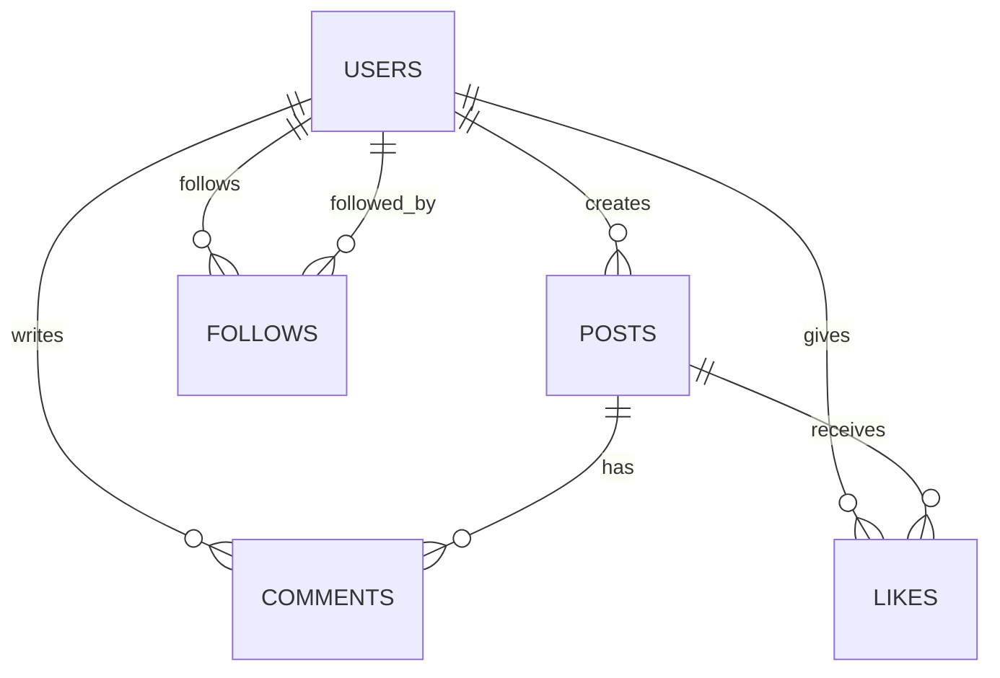

# Laporan Analisis: StatusShare (Supabase + Upstash Redis)

## 1. Ringkasan Sistem
StatusShare adalah aplikasi media sosial sederhana dengan skala awal sekitar 10.000 pengguna dan 50.000 postingan. Fitur utamanya meliputi: timeline dari akun yang diikuti, like dan komentar, follow/unfollow, serta melihat profil user beserta daftar postingannya. Tantangan utama ada pada timeline feed, hitungan like yang akurat dan cepat, relasi follow yang banyak, serta kebutuhan responsif ketika data tumbuh.

Solusi yang diajukan: gunakan Supabase (PostgreSQL) sebagai database utama untuk data relasional yang membutuhkan konsistensi dan query kompleks, serta Upstash Redis sebagai cache dan penyimpan counter real-time agar operasi like dan timeline tetap cepat.

## 2. Alasan Pemilihan Teknologi Basis Data
### a) Supabase (PostgreSQL)
PostgreSQL cocok karena data utama bersifat relasional: user memiliki banyak post, post memiliki banyak comment, dan ada relasi many-to-many antara user dan post melalui like, serta user dan user melalui follow. Data ini membutuhkan:
- transaksi ACID untuk konsistensi (misalnya saat like, mencegah double-like),
- indeks dan join yang efisien untuk timeline,
- dukungan agregasi dan pagination yang stabil,
- kemampuan constraint (unique, foreign key) untuk menjaga integritas.

Supabase memudahkan akses PostgreSQL melalui API dan menyediakan Row Level Security (RLS) untuk kontrol akses. Dalam konteks tugas, ini membantu membatasi siapa yang dapat melihat/mengubah data tanpa menambah banyak kode keamanan di backend.
Selain itu, PostgreSQL kuat dalam mendukung query analitis sederhana (misalnya total like per user) serta extensibility (function, trigger, materialized view). Bila di tahap lanjut diperlukan full-text search atau rekomendasi, PostgreSQL sudah menyediakan fitur dasar seperti GIN index dan tsvector.

### b) Upstash Redis
Redis dipakai untuk caching data yang sering dibaca dan untuk counter yang sering di-update (likes_count, followers_count), karena:
- operasi in-memory sangat cepat,
- mendukung atomic increment (INCR/HINCRBY) untuk hitungan,
- cocok untuk TTL cache (timeline, profil ringkas),
- bisa dipakai sebagai rate limiter dan anti-abuse.

### c) Mengapa bukan MongoDB saja?
MongoDB bisa menyimpan data post dan comment dengan mudah, tetapi:
- timeline membutuhkan query relasional (ikuti -> post dari followees) yang lebih natural di SQL,
- transaksi multi dokumen tidak sekuat Postgres untuk menjaga integritas likes dan follows,
- banyak operasi butuh join, agregasi, dan constraint yang jelas.
MongoDB lebih cocok saat struktur data sangat fleksibel dan sering berubah. Pada kasus StatusShare, struktur data relatif stabil, sehingga keunggulan model relasional lebih terasa.

Kesimpulan: Kombinasi PostgreSQL (Supabase) + Redis (Upstash) memberi keseimbangan antara konsistensi data relasional dan performa real-time.

## 3. Model Data (ER Diagram dan Struktur Tabel)
Entitas utama:
- users: data user
- posts: konten user
- comments: komentar di post
- likes: relasi user yang menyukai post
- follows: relasi user mengikuti user lain

### ER Diagram (Mermaid)


### Struktur Tabel 
```sql
-- Extensions (biasanya sudah ada, tapi aman)
create extension if not exists pgcrypto;

-- 1) Profiles (link ke auth.users)
create table if not exists public.profiles (
  id uuid primary key references auth.users(id) on delete cascade,
  username varchar(30) not null unique,
  bio text,
  profile_picture_url text,
  created_at timestamptz not null default now()
);

-- 2) Posts
create table if not exists public.posts (
  id uuid primary key default gen_random_uuid(),
  user_id uuid not null references public.profiles(id) on delete cascade,
  content text not null,
  image_url text,
  created_at timestamptz not null default now(),
  likes_count int not null default 0,
  comments_count int not null default 0
);

-- 3) Follows
create table if not exists public.follows (
  follower_id uuid not null references public.profiles(id) on delete cascade,
  following_id uuid not null references public.profiles(id) on delete cascade,
  created_at timestamptz not null default now(),
  primary key (follower_id, following_id),
  constraint chk_no_self_follow check (follower_id <> following_id)
);

-- 4) Likes (1 user 1 like per post)
create table if not exists public.likes (
  id uuid primary key default gen_random_uuid(),
  post_id uuid not null references public.posts(id) on delete cascade,
  user_id uuid not null references public.profiles(id) on delete cascade,
  created_at timestamptz not null default now(),
  constraint uq_like unique (post_id, user_id)
);

-- 5) Comments
create table if not exists public.comments (
  id uuid primary key default gen_random_uuid(),
  post_id uuid not null references public.posts(id) on delete cascade,
  user_id uuid not null references public.profiles(id) on delete cascade,
  text text not null,
  created_at timestamptz not null default now()
);

-- Indexes
create index if not exists idx_posts_user_created on public.posts (user_id, created_at desc);
create index if not exists idx_posts_created on public.posts (created_at desc);
create index if not exists idx_follows_following on public.follows (following_id);
create index if not exists idx_likes_post_created on public.likes (post_id, created_at desc);
create index if not exists idx_comments_post_created on public.comments (post_id, created_at desc);

-- likes_count
create or replace function public.inc_likes_count()
returns trigger language plpgsql as $$
begin
  update public.posts set likes_count = likes_count + 1 where id = new.post_id;
  return new;
end; $$;

create or replace function public.dec_likes_count()
returns trigger language plpgsql as $$
begin
  update public.posts set likes_count = greatest(likes_count - 1, 0) where id = old.post_id;
  return old;
end; $$;

drop trigger if exists trg_inc_likes on public.likes;
create trigger trg_inc_likes after insert on public.likes
for each row execute function public.inc_likes_count();

drop trigger if exists trg_dec_likes on public.likes;
create trigger trg_dec_likes after delete on public.likes
for each row execute function public.dec_likes_count();

-- comments_count
create or replace function public.inc_comments_count()
returns trigger language plpgsql as $$
begin
  update public.posts set comments_count = comments_count + 1 where id = new.post_id;
  return new;
end; $$;

create or replace function public.dec_comments_count()
returns trigger language plpgsql as $$
begin
  update public.posts set comments_count = greatest(comments_count - 1, 0) where id = old.post_id;
  return old;
end; $$;

drop trigger if exists trg_inc_comments on public.comments;
create trigger trg_inc_comments after insert on public.comments
for each row execute function public.inc_comments_count();

drop trigger if exists trg_dec_comments on public.comments;
create trigger trg_dec_comments after delete on public.comments
for each row execute function public.dec_comments_count();

alter table public.profiles enable row level security;
alter table public.posts enable row level security;
alter table public.follows enable row level security;
alter table public.likes enable row level security;
alter table public.comments enable row level security;

-- read semua profile
create policy "profiles_read_all"
on public.profiles for select
to authenticated
using (true);

-- user hanya boleh insert profil dirinya
create policy "profiles_insert_own"
on public.profiles for insert
to authenticated
with check (auth.uid() = id);

-- user hanya boleh update profil dirinya
create policy "profiles_update_own"
on public.profiles for update
to authenticated
using (auth.uid() = id)
with check (auth.uid() = id);

create policy "posts_read_all"
on public.posts for select
to authenticated
using (true);

create policy "posts_insert_own"
on public.posts for insert
to authenticated
with check (auth.uid() = user_id);

create policy "posts_update_own"
on public.posts for update
to authenticated
using (auth.uid() = user_id)
with check (auth.uid() = user_id);

create policy "posts_delete_own"
on public.posts for delete
to authenticated
using (auth.uid() = user_id);

create policy "follows_read_all"
on public.follows for select
to authenticated
using (true);

create policy "follows_insert_own"
on public.follows for insert
to authenticated
with check (auth.uid() = follower_id);

create policy "follows_delete_own"
on public.follows for delete
to authenticated
using (auth.uid() = follower_id);

create policy "likes_read_all"
on public.likes for select
to authenticated
using (true);

create policy "likes_insert_own"
on public.likes for insert
to authenticated
with check (auth.uid() = user_id);

create policy "likes_delete_own"
on public.likes for delete
to authenticated
using (auth.uid() = user_id);

create policy "comments_read_all"
on public.comments for select
to authenticated
using (true);

create policy "comments_insert_own"
on public.comments for insert
to authenticated
with check (auth.uid() = user_id);

create policy "comments_delete_own"
on public.comments for delete
to authenticated
using (auth.uid() = user_id);

```

Indeks utama:
- posts(user_id, created_at desc) untuk profil user dan timeline
- comments(post_id, created_at desc) untuk pagination komentar
- follows(follower_id, following_id) untuk follow/unfollow cepat
- likes(post_id, user_id) untuk cek duplicate like

## 4. Implementasi Operasi Utama (7 Query)
Semua query di bawah ditulis untuk PostgreSQL (Supabase).

### 1) Timeline: post dari user yang di-follow
```sql
select p.*
from follows f
join posts p on p.user_id = f.following_id
where f.follower_id = $1
  and (p.created_at, p.id) < ($2, $3)
order by p.created_at desc, p.id desc
limit 20;
```
Keterangan: gunakan keyset pagination dengan (created_at, id) agar stabil dan cepat.

### 2) Like post tertentu (hindari double-like)
```sql
begin;

insert into likes (post_id, user_id)
values ($1, $2)
on conflict do nothing;

update posts
set likes_count = likes_count + 1
where id = $1
  and exists (
    select 1 from likes
    where post_id = $1 and user_id = $2
  );

commit;
```
Keterangan: constraint primary key mencegah duplicate. Update hanya jika like berhasil masuk.

### 3) Add comment ke post
```sql
insert into comments (id, post_id, user_id, content)
values (gen_random_uuid(), $1, $2, $3);

update posts
set comments_count = comments_count + 1
where id = $1;
```
Keterangan: bisa dibungkus dalam transaction bila perlu konsistensi ketat.

### 4) Get comments pada post dengan pagination
```sql
select c.*, u.username, u.profile_picture_url
from comments c
join users u on u.id = c.user_id
where c.post_id = $1
  and (c.created_at, c.id) < ($2, $3)
order by c.created_at desc, c.id desc
limit 20;
```
Keterangan: pagination berbasis keyset, stabil walau ada komentar baru.

### 5) Follow user
```sql
insert into follows (follower_id, following_id)
values ($1, $2)
on conflict do nothing;
```
Keterangan: constraint mencegah follow ganda.

### 6) Unfollow user
```sql
delete from follows
where follower_id = $1 and following_id = $2;
```

### 7) Profil user + jumlah post, likes, followers
```sql
select
  u.id,
  u.username,
  u.bio,
  u.profile_picture_url,
  (select count(*) from posts p where p.user_id = u.id) as posts_count,
  (select count(*) from follows f where f.following_id = u.id) as followers_count,
  (select count(*) from follows f where f.follower_id = u.id) as following_count,
  (select coalesce(sum(p.likes_count), 0) from posts p where p.user_id = u.id) as total_likes
from users u
where u.id = $1;
```
Catatan: view atau materialized view dapat dipakai untuk mempercepat agregasi ini.

## 5. Strategi Caching dan Optimasi
### a) Timeline feed
Timeline adalah query mahal karena join antara follows dan posts. Untuk mengurangi beban:
- Cache list post_id pada Redis: `timeline:{user_id}:{cursor}` dengan TTL 30-60 detik.
- Cache hasil query untuk page pertama (yang paling sering diakses).
- Invalidation: ketika user membuat post baru, hapus cache timeline follower yang relevan (untuk skala kecil). Untuk skala besar, gunakan TTL pendek dan hanya refresh saat dibutuhkan.

### b) Cache post dan komentar
- Cache post ringkas di Redis: `post:{post_id}` dengan TTL 5-10 menit.
- Cache halaman komentar: `post:{post_id}:comments:{cursor}` dengan TTL 1-2 menit, karena komentar lebih dinamis.
Cache ini biasanya cukup untuk mengurangi query berulang ketika user membuka post yang sama berkali-kali atau pindah halaman komentar. Bila aplikasi menyediakan notifikasi komentar baru, cache komentar bisa di-invalidate secara selektif untuk post tersebut.

### c) Counter real-time (likes, followers)
Gunakan Redis untuk counter:
- `post:{post_id}:likes` disimpan di Redis, update dengan INCR saat like masuk.
- Sinkronisasi ke PostgreSQL dengan batch setiap 5-10 detik atau setiap N update.
Pendekatan ini membuat API responsif tanpa menunggu update DB.
Untuk followers_count, pendekatan yang sama bisa dipakai: saat follow/unfollow, update counter di Redis, lalu sinkronisasi berkala. Di sisi UI, tampilkan angka Redis sebagai angka real-time, dan gunakan nilai DB untuk laporan atau perhitungan periodik.

### d) Indeks dan query tuning
Indeks yang disarankan:
- posts(user_id, created_at desc)
- comments(post_id, created_at desc)
- follows(follower_id, following_id)
- likes(post_id, user_id)
Gunakan keyset pagination agar tidak lambat saat data besar (hindari OFFSET besar).

### e) Pertimbangan caching timeline
Caching timeline perlu, terutama untuk user aktif karena:
- timeline adalah query yang paling sering dipanggil,
- data di timeline relatif cepat berubah,
- caching mengurangi load join besar.
Namun, perlu trade-off antara konsistensi dan performa. Untuk MVP, TTL pendek cukup.

## 6. Skenario: Celebrity post dapat 5.000 likes dalam 1 menit
Masalah utama adalah lonjakan write ke tabel likes dan update likes_count.
Strategi:
1) Set Redis sebagai layer pertama:
   - ketika like masuk: jalankan Lua script di Redis yang:
     - cek user sudah like atau belum (set `post:{id}:liked_users`)
     - jika belum, tambahkan user ke set dan INCR counter
   Ini membuat operasi like tetap O(1).
2) Asinkronisasi ke PostgreSQL:
   - kumpulkan batch like ke queue,
   - masukkan ke tabel likes secara bulk insert,
   - update posts.likes_count secara berkala dengan nilai Redis.
3) Konsistensi:
   - likes_count di UI boleh bersifat eventual consistency (tampilkan angka Redis),
   - untuk data final (misalnya statistik harian), ambil dari DB.
4) Proteksi:
   - gunakan rate limit per user,
   - gunakan unique constraint di likes untuk mencegah duplikasi bila ada fallback ke DB.

Hasilnya: API tetap responsif, beban DB stabil, dan angka like tetap akurat dengan toleransi kecil terhadap delay sinkronisasi.

## 7. Kesimpulan
Supabase (PostgreSQL) menyelesaikan kebutuhan data relasional dan konsistensi, sementara Upstash Redis memberikan performa tinggi untuk caching dan counter real-time. Dengan desain tabel yang tepat, indeks yang sesuai, keyset pagination, serta strategi caching yang terukur, aplikasi StatusShare bisa melayani timeline, follow, like, dan komentar dengan respons cepat meskipun skalanya meningkat.
